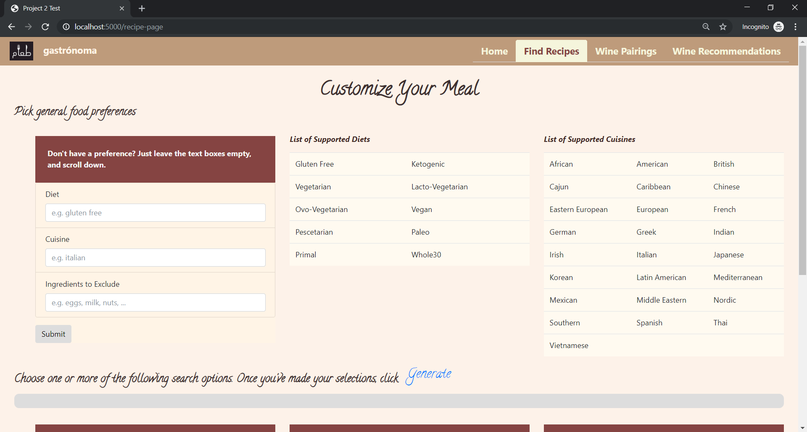
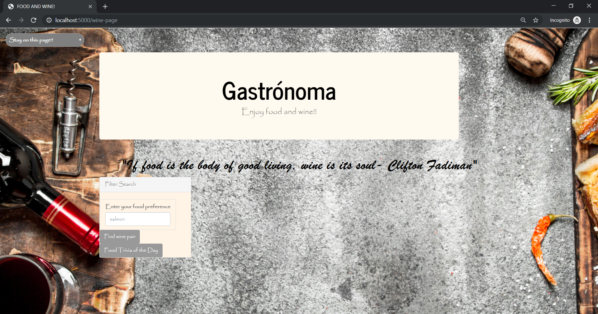

# FOOD WINE AND PREP!

## Project Summary
The aim of this project was to create a multiple webpage application supported by Python, JavaScript, HTML, CSS, d3 and plotly. The app is designed to give users the option to: 
- Find recipes tailored to their dietary specs.
- Pair wine with a given dish/foodtype. 
- Find the best suppliear of a given wine.

## Data Source
Our search engine was powered by Spoonacular API.

## Testing the Application
If you would like to test out the application

- Sign up for an API key [here](https://spoonacular.com/food-api/pricing).
- Clone this repository.
- Create a file titled config.py.
    - Within the file, create a variable called: apiKey = "".
    - Copy your API key into the file.

## Here's a preview of our application
### Recipe Search Page

### Wine Pairing Page

